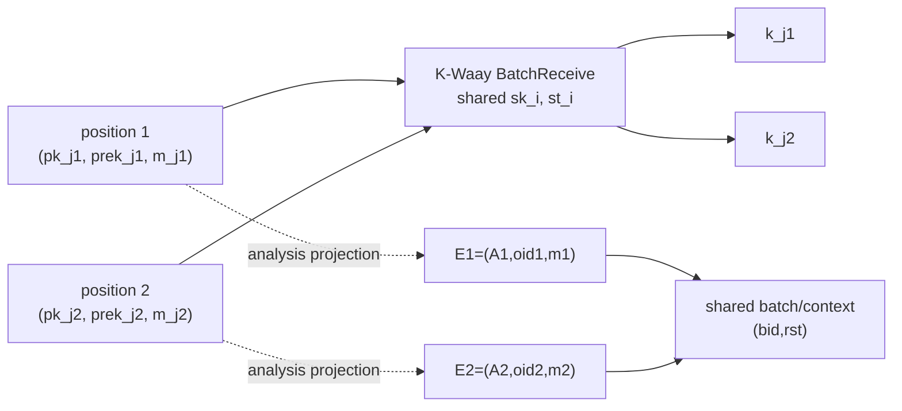

# 图1绘制规范：K-Waay BatchReceive输入条目、索引输出与参与方投影关系

## 1. 图题与证据属性

- 中文图题：**图1 K-Waay BatchReceive输入条目、索引输出与参与方投影关系**
- 英文图题：**Fig. 1 Input Entries, Indexed Outputs, and Party Projections in K-Waay BatchReceive**
- 图下注记：**依据 K-Waay 接口事实与本文抽象人工整理；源接口到符号模型之间尚未建立精化证明。**
- 证据属性：接口—抽象关系示意图，不是 K-Waay 原论文图 10 的复制图，也不是已经验证的 refinement 图。

## 2. 必须表达的源接口事实

左侧绘制一次 `BatchReceive` 调用。接收方使用同一个长期秘密 `sk_i` 和接收方状态 `st_i`，输入向量的第 $\ell$ 个分量为

$$
(pk_{j_\ell},prek_{j_\ell},m_{j_\ell}),
$$

输出为按相同参与方下标组织的 $k_{j_\ell}$。用一个“批内不同参与方”括号覆盖各输入分量，标出原规范要求 $j_p\ne j_q$（$p\ne q$）。不得把位置 $\ell$ 与参与方下标 $j_\ell$ 画成同一个概念。

## 3. 必须表达的分析投影

右侧绘制当前符号分析采用的条目

$$
E_\ell=(A_\ell,oid_\ell,m_\ell).
$$

从源输入分量到 $E_\ell$ 只画“分析投影”虚线，并分别标出：

- $A_\ell$：模型参与方坐标；
- $oid_\ell$：模型内一次发送实例的标识，不等同于 K-Waay transcript `sid`；
- $m_\ell$：新鲜符号消息坐标；
- $\ell$：固定两槽分析中的位置。

图中用醒目标注说明：密码运算、接收方秘密状态、预密钥绑定、KDF、输出密钥和 `KEY/TEST` 查询没有被映射进当前接纳模型。

## 4. 推荐版式

采用左右两栏：

1. 左栏为 K-Waay 源接口，画出两个代表性输入位置及对应输出；
2. 中间为虚线箭头“仅保留批处理接纳关系”；
3. 右栏为 $E_1,E_2$ 与共享的 $(bid,rst)$；
4. 右栏下方注明机器验证固定为两槽，任意有限批次的 `DistinctPartyPerBatch` 仅为语义定义。

该 Mermaid 只作为布局草图。正式 Word 制稿时应重绘为可编辑矢量图，并保留中英文图题和来源—抽象边界说明。

## 5. 禁止加入的含义

- 不把虚线投影称为已经证明的 simulation 或 refinement。
- 不把 $A_\ell$ 自动等同于账户、公钥字节串或数据库身份。
- 不把 $oid_\ell$ 标为 K-Waay transcript `sid`。
- 不画出当前模型没有的密钥、`KEY/TEST`、应用安装或攻击结果。
- 不暗示原 K-Waay 规范遗漏了批内不同参与方条件。
