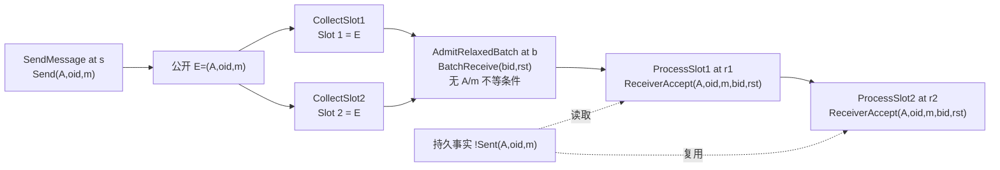

# 图2绘制规范：宽松接纳模型中的精确来源重复接受执行

## 1. 图题与证据属性

- 中文图题：**图2 宽松接纳模型中的精确来源重复接受执行**
- 英文图题：**Fig. 2 Exact-Origin Duplicate-Acceptance Execution in the Relaxed Model**
- 图下注记：**根据 Tamarin 见证人工整理。**
- 证据属性：研究示意图，不是 Tamarin 直接导出的原始 attack graph，也不是完整 K-Waay 执行。

## 2. 机器依据

- 模型：`tamarin/rq-v2-minimal/rqv2_relaxed.spthy`。
- 存在性 lemma：`one_send_two_accepts_exists`，independent rerun 为 `verified (13 steps)`。
- 对应导出 graph：`reviews/2026-09-16-evidence/rqv2_relaxed-traces.json` 中标签包含 `one_send_two_accepts_exists` 的 graph。
- 对照反例：同一 JSON 中标签包含 `receiver_accept_injective-case_1` 的 graph；对应 all-traces lemma 为 `falsified - found trace (13 steps)`。
- 结果比对：`reviews/2026-09-16-evidence/result-comparison.tsv`，两项均为 `MATCH`。

## 3. 必须绘制的主线

图按从左到右的时间顺序绘制，使用同一组符号 $A,oid,m,bid,rst$：

1. `SendMessage` 在时间点 $s$ 产生 `Send(A,oid,m)`，公开 $E=(A,oid,m)$，并保存持久来源事实 $!Sent(A,oid,m)$。
2. `CollectSlot1` 收集 $E$ 到 Slot 1。
3. `CollectSlot2` 再次收集同一个 $E$ 到 Slot 2。
4. `AdmitRelaxedBatch` 不执行坐标不等检查，并在时间点 $b$ 产生 `BatchReceive(bid,rst)`。
5. `ProcessSlot1` 读取 $!Sent(A,oid,m)$，在 $r_1$ 产生 `ReceiverAccept(A,oid,m,bid,rst)`。
6. `ProcessSlot2` 复用同一持久来源事实，在 $r_2$ 产生参数相同的第二个 `ReceiverAccept`。
7. 在时间轴下方写出 $s<b<r_1<r_2$。

两个槽位必须画成不同容器，但容器内三元组完全相同。两个 `ReceiverAccept` 必须画成不同事件节点，并用 $r_1$、$r_2$ 标出不同时间点。

## 4. 来源复用的表示

将 $!Sent(A,oid,m)$ 画为单独的持久事实节点，以两条虚线分别连接 `ProcessSlot1` 和 `ProcessSlot2`。图例说明：虚线表示两个处理规则读取同一持久事实，不表示发生第二次匹配发送。

存在性公式还要求

$$
\forall s_2.\ 
\operatorname{Send}(A,oid,m)@s_2
\Rightarrow s_2=s.
$$

图中可在 `SendMessage` 节点旁标注“该精确三元组的唯一匹配 Send”。不得简写为“整条轨迹只有一次 Send”。独立导出 graph 含有一个与见证变量无关的其他 `Send`；正文主图可为清晰起见省略该无关事件，但图注或正文必须保留上述限定。

## 5. 推荐版式

推荐采用两层结构：

- 上层：`SendMessage`、两次收集、宽松接纳、两次处理的实线时间主轴；
- 下层：单个 $!Sent(A,oid,m)$ 持久事实及指向两个处理节点的虚线；
- 在两次收集之间用“同一公开条目 $E$”标识重复输入；
- 在接纳节点上写“无 $A/m$ 不等 guard”；
- 在两个接受节点外加一个共享边框，标注“同一 $(bid,rst)$”。

建议颜色仅用于区分语义角色：发送/来源为蓝色，槽位与接纳为灰色，两个接受事件为橙色。黑白打印时仍应通过线型和标签保持可读。

## 6. 可编辑草图

该 Mermaid 仅作为可编辑布局草图。后续 Word/矢量绘图应按第 3～5 节规范重绘，并保留中英文图题和人工整理声明。

## 7. 禁止加入的含义

- 不绘制真实 K-Waay 密钥、KEM/KDF、`KEY/TEST` 或应用安装。
- 不把 `ReceiverAccept` 改写为“认证成功”“密钥安装”或“应用接受”。
- 不标注“协议攻击成功”“重放漏洞”或“攻击者冒充参与方”。
- 不暗示见证满足 K-Waay 的 different-party condition。
- 不把人工整理图称为 Tamarin 原始输出。
